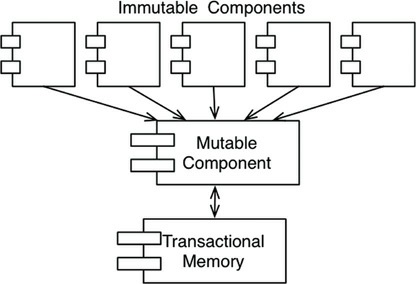

# 6장 함수형 프로그래밍

D-DAY: D +6
Date: Mar 20, 2021
완료: No

함수형 프로그래밍 패러다임에서 핵심이 되는 기반은 람다(lambda) 계산법으로 알론조 처치(Alonzo Church)가 1930년대에 발명했다.

## 정수를 제곱하기

---

- 리스프에서 파생한 클로저(Clojure)는 함수형 언어이다.
- 자바 프로그램은 가변 변수(Mutable variable)를 사용하는데, 가변 변수는 프로그램 실행 중에 상태가 변할 수 있다.
- 클로저 프로그램에서는 이러한 가변 변수가 전혀 없다.
- 함수형 언어에선 **변수가 한 번 초기화 되면 절대로 변하지 않는다.**

## 불변성과 아키텍처

---

아키텍처를 고려할 때 이러한 내용이 왜 중요하고 왜 변수의 가변성을 염려할까? 아래와 같은 문제가 모두 가변 변수로 인해 발생하기 때문이다.

- 경합(race) 조건
- 교착상태(deadlock) 조건
- 동시 업데이트(concurrent update) 문제

아키텍트라면 **동시성(concurrency)** 문제에 큰 관심을 가져야만 한다.

불변성을 정말로 실현 가능할까?

- 긍정적
- 저장 공간이 무한하고 프로세서의 속도가 무한이 빠르다는 전제에 한해 가능
- 실현 가능하지만 일종의 **타협**을 해야 한다.

## 가변성의 분리

---

불변성과 관련하여 가장 주요한 타협 중 하나는 가변 컴포넌트와 불변 컴포넌트로 분리하는 것이다.

- 불변 컴포넌트에서는 순수하게 함수형 방식으로만 작업이 처리되고, 어떤 가변 변수도 사용되지 않는다.
- 불변 컴포넌트는 변수의 상태를 변경할 수 있는, 즉 순수 함수형 컴포넌트가 아닌 하나 이상의 다른 컴포넌트와 서로 통신한다(그림 6.1).

그림 6.1 상태 변경과 트랜잭션 메모리(transactional memory)

핵심은, 애플리케이션을 제대로 구조화하려면 **변수를 변경하는 컴포넌트와 변경하지 않는 컴포넌트를 분리**해야 한다는 것이다.

현명한 아키텍트라면 가능한 많은 처리를 불변 컴포넌트에서 하고, 가변 컴포넌트에서는 코드를 줄여야 한다.

## 이벤트 소싱

---

저장 공간과 처리 능력의 한계는 급격히 희미해지고 있다. 따라서 가변 상태는 적어질 수 있다.

**이벤트 소싱(event sourcing)**은 상태가 아닌 트랜잭션을 저장하자는 전략이다.

- 상태가 필요해지면 단순히 상태의 시작점부터 모든 트랜잭션을 처리한다.

저장 공간과 처리 능력이 충분하면 애플리케이션이 완전한 불변성을 갖도록 만들 수 있고, 따라서 **완전한 함수형**으로 만들 수 있다.

ex) 소스 코드 버전 관리 시스템이 이 방식으로 동작한다고 한다.

## 결론

---

- 구조적 프로그래밍은 제어흐름의 직접적인 전환에 부과되는 규율이다.
- 객체 지향 프로그래밍은 제어흐름의 간접적인 전환에 부과되는 규율이다.
- 함수형 프로그래밍은 변수 할당에 부과되는 규율이다.

**소프트웨어, 즉 컴퓨터 프로그램은 순차(sequence), 분기(selection), 반복(iteration), 참조(indirection)로 구성된다.** 그 이상도 이하도 아니다.